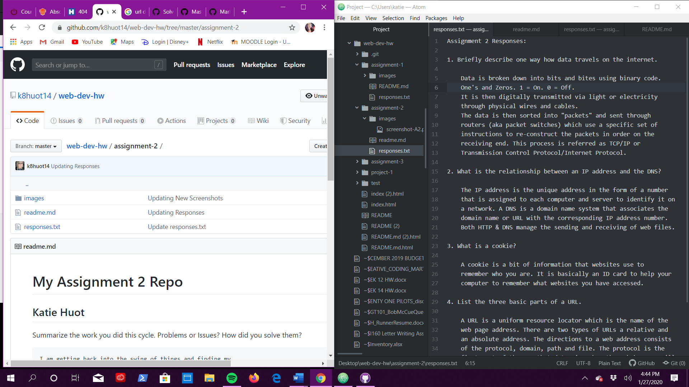

# My Assignment 2 Repo
## Katie Huot

Summarize the work you did this cycle.
Problems or Issues? How did you solve them?

    I am getting back into the swing of things and finding my
    work flow again. Updating older files and making corrections
    on responses, taking new screenshots, making sure all steps have
    bene completed.

3 things I've learned:

* markdown language
* how to navigate Atom and github
* online class work flow

My [Responses](./responses.txt)

