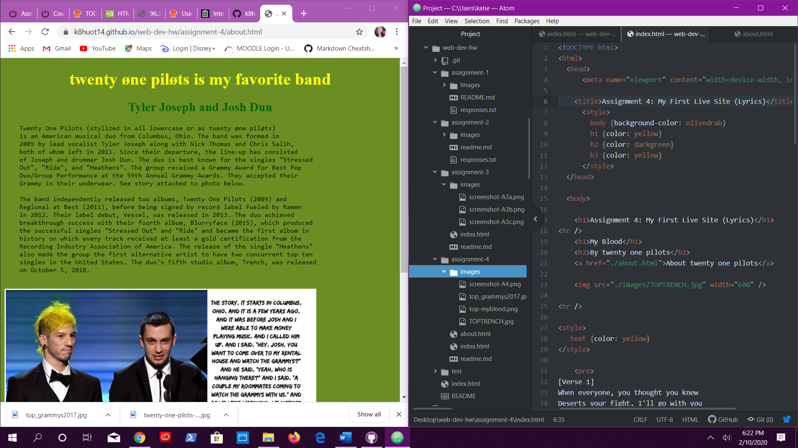

# My Intro-Web-Dev Homework Repo
## Assignment 4 Repo
## Katie Huot

Describe your experience with the Wayback Machine. Visit a site snapshot that is at least 10 years old... Where did you go? What did it look like? How has it changed?

    When I visited the Wayback Machine, I looked up myspace.com from it's very beginning to current. I cannot log on to my old profile any longer, but it would be really cool to be able to see what my page looks like from back then when I was actively using it. My first experience with ANY kind of coding was from customizing my myspace page. I wonder if there are any users who still actively use myspace...

    I also looked at 963theblaze.com from 2008 when I used
    to be the intern and managed their websites and advertising graphics. It is interesting to see how many
    attributes would not load and how long it takes for those older pages to load in the first place.

