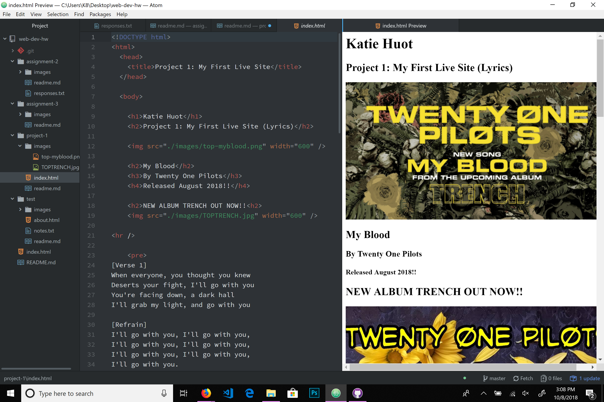

# My Project 1 Repo

B. List any browsers you use to surf, or even develop for, the web (this could be for your mobile device, too). Very briefly detail how a browser functions.

    I used two browsers on my computer for P1, Mozilla Firefox and Microsoft Edge. I also checked my P1 on my mobile using Google's mobile browser search.
    A web browser is simply the software that allows the user to view websites (or web pages) via the specific "web address" for each site/page. A web address is the uniform resource locator (more commonly known as the URL) that is assigned to every website so that users and servers can find that site quickly and easily.

C. Describe your experience with the Wayback Machine. Visit a site snapshot from the year 2000 or earlier... Where did you go? What did it look like? How has it changed?

    When I visited the Wayback Machine, I looked up myspace.com from it's very beginning to current. I cannot log on to my old profile any longer, but it would be really cool to be able to see what my page looks like from back then when I was actively using it. My first experience with ANY kind of coding was from customizing my myspace page. I wonder if there are any users who still actively use myspace...

D. Summarize your work cycle for this assignment.

    I wasn't feeling very confident with my progress in this class until I met with our instructor, Justine, during her office hours to address the few issues I had run into. A lot of things started to "click" for me after this one-on-one and I'm almost all the way caught up with the current assignments. I also feel much more confident with the work flow now that I have the hang of things.

E. Embed a screenshot of your workspace at some point during your development cycle.

